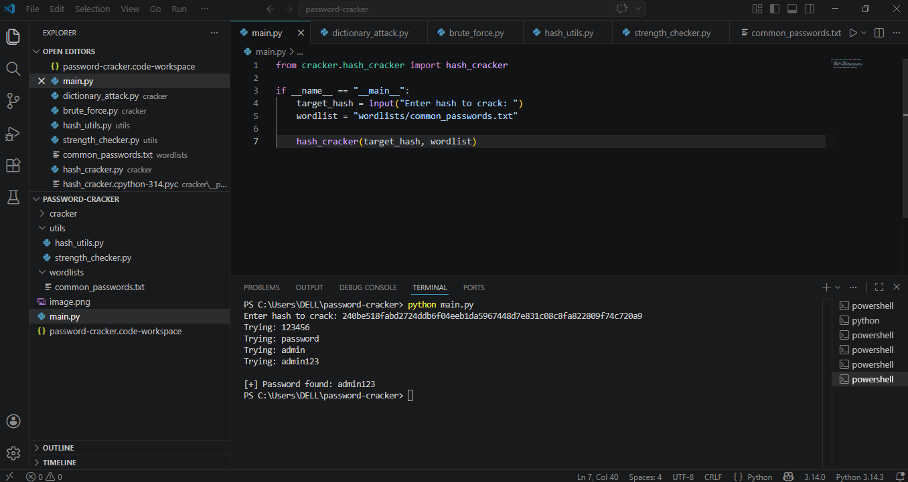

# 🔐 Password Cracker Simulator

A beginner-friendly cybersecurity project demonstrating how weak passwords can be cracked using dictionary attacks and SHA-256 hashing.

---

## 🚀 Features

* 🔎 Dictionary Attack (wordlist-based)
* 🔐 SHA-256 Hash Cracking
* ⚡ Password Strength Checker
* 📂 File-based password testing

---

## 🛠️ Tech Stack

* Python
* hashlib

---

## 📁 Project Structure

```
password-cracker-simulator/
│
├── main.py
├── dictionary_attack.py
├── brute_force.py
├── hash_cracker.py
├── hash_utils.py
├── strength_checker.py
├── common_passwords.txt
├── image.png
└── README.md
```

---

## ⚙️ Installation & Usage

1. Clone the repository:
   git clone https://github.com/pavan12312Amcet/password-cracker-simulator.git

2. Navigate to folder:
   cd password-cracker-simulator

3. Run the program:
   python main.py

---

## 📸 Output Example



---

## 🧠 How It Works

* Takes a password or hash as input
* Uses a wordlist to try passwords
* Converts each word into SHA-256 hash
* Compares with target hash
* Displays result if matched

---

## ⚠️ Disclaimer

This project is created for **educational purposes only**. Do not use it for illegal activities.

---

## 🚀 Future Improvements

* Add GUI interface
* Support multiple hashing algorithms
* Improve brute-force performance
